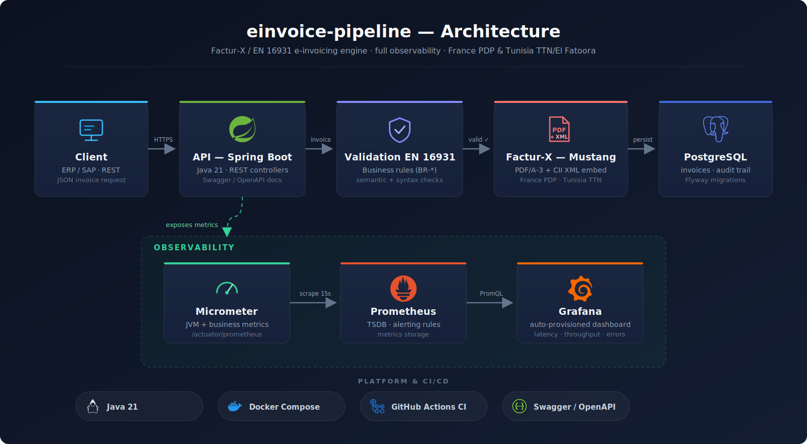

# einvoice-pipeline

**FR —** Moteur de génération et de validation de factures électroniques européennes (Factur-X / EN 16931) avec observabilité complète, packagé en un stack Docker prêt à démarrer.

**EN —** Generation and validation engine for European electronic invoices (Factur-X / EN 16931), with full observability, packaged as a ready-to-run Docker stack.

[](https://github.com/Iyed-wed/einvoice-pipeline/actions/workflows/ci.yml)

---

## 🇫🇷 Français

### Ce que fait le projet

`einvoice-pipeline` reçoit une facture (JSON, CSV ou depuis SAP), la **valide** selon les règles métier de la norme **EN 16931**, **génère** un fichier **Factur-X** (PDF/A-3 avec XML CII embarqué) via la librairie [Mustang Project](https://www.mustangproject.org/), **persiste** une trace d'audit dans PostgreSQL, et **expose des métriques** consommées par Prometheus et visualisées dans Grafana.

La différenciation ne vient pas de la génération XML (déjà commoditisée) mais de la **qualité d'ingénierie** : validation conforme, erreurs structurées, observabilité de bout en bout, et tests d'intégration contre une vraie base de données.

### Architecture en un coup d'œil

<p align="center">
  
</p>

Les **trois portes d'entrée** convergent vers le **même moteur** (`InvoiceProcessingService`) : formulaire web (cas « pas d'ERP »), import CSV (cas « ERP autre que SAP »), et passerelle SAP (approche OData / BAPI-RFC documentée).

### Démarrage rapide

Prérequis : Docker + Docker Compose.

```bash
docker compose up -d --build
```

Cela démarre quatre services avec healthchecks : l'application, PostgreSQL, Prometheus et Grafana. L'application attend que la base soit saine avant de démarrer.

| Service | URL | Identifiants |
|---|---|---|
| API + formulaire web | http://localhost:8080 | — |
| Swagger UI (doc API) | http://localhost:8080/swagger-ui.html | — |
| Endpoint Prometheus | http://localhost:8080/actuator/prometheus | — |
| Grafana (dashboard) | http://localhost:3000 | `admin` / `admin` |
| Prometheus | http://localhost:9090 | — |

Le dashboard Grafana **einvoice-pipeline** est provisionné automatiquement (factures générées/rejetées, débit, latence p50/p95, rejets par règle EN 16931).

### Exemple curl

```bash
# Génère une facture Factur-X à partir de JSON et l'enregistre en PDF
curl -X POST http://localhost:8080/api/invoices \
  -H "Content-Type: application/json" \
  -d @sample-invoice.json -o facture.pdf

# Import CSV (export ERP générique)
curl -X POST http://localhost:8080/api/invoices/import-csv \
  -H "Content-Type: text/csv" \
  --data-binary @sample-invoice.csv -o facture.pdf
```

Une facture incohérente renvoie une erreur **RFC 7807** (`application/problem+json`) citant la règle violée :

```json
{
  "type": "urn:einvoice-pipeline:problem:en16931-violation",
  "title": "Invoice violates EN 16931 business rules",
  "status": 422,
  "errors": [
    { "rule": "BR-CO-15", "field": "totalWithVat",
      "message": "Declared total with VAT (999.00) does not equal total without VAT + VAT (300.00)" }
  ]
}
```

### Tests

```bash
./mvnw verify
```

Les tests d'intégration utilisent **Testcontainers** (vrai PostgreSQL en conteneur), donc un démon Docker doit être disponible. La CI GitHub Actions rejoue build + tests à chaque push.

---

## 🇬🇧 English

### What it does

`einvoice-pipeline` accepts an invoice (JSON, CSV, or from SAP), **validates** it against the **EN 16931** business rules, **generates** a **Factur-X** file (PDF/A-3 with embedded CII XML) using the [Mustang Project](https://www.mustangproject.org/) library, **persists** an audit trail in PostgreSQL, and **exposes metrics** scraped by Prometheus and visualized in Grafana.

The differentiator is not the XML generation (already a commodity) but the **engineering quality**: standards-compliant validation, structured errors, end-to-end observability, and integration tests against a real database.

### Architecture at a glance

<p align="center">
  
</p>

The **three entry points** converge on the **same engine** (`InvoiceProcessingService`): web form (no-ERP case), CSV import (non-SAP ERP case), and an SAP gateway (documented OData / BAPI-RFC approach).

### Quick start

Requirements: Docker + Docker Compose.

```bash
docker compose up -d --build
```

This starts four services with healthchecks: the application, PostgreSQL, Prometheus and Grafana. The app waits for a healthy database before starting.

| Service | URL | Credentials |
|---|---|---|
| API + web form | http://localhost:8080 | — |
| Swagger UI (API docs) | http://localhost:8080/swagger-ui.html | — |
| Prometheus endpoint | http://localhost:8080/actuator/prometheus | — |
| Grafana (dashboard) | http://localhost:3000 | `admin` / `admin` |
| Prometheus | http://localhost:9090 | — |

The **einvoice-pipeline** Grafana dashboard is auto-provisioned (generated/rejected invoices, throughput, p50/p95 latency, rejections by EN 16931 rule).

### curl example

```bash
# Generate a Factur-X invoice from JSON and save it as a PDF
curl -X POST http://localhost:8080/api/invoices \
  -H "Content-Type: application/json" \
  -d @sample-invoice.json -o facture.pdf

# CSV import (generic ERP export)
curl -X POST http://localhost:8080/api/invoices/import-csv \
  -H "Content-Type: text/csv" \
  --data-binary @sample-invoice.csv -o facture.pdf
```

An inconsistent invoice returns an **RFC 7807** error (`application/problem+json`) citing the violated rule (see the JSON example in the French section above).

### Tests

```bash
./mvnw verify
```

Integration tests use **Testcontainers** (a real PostgreSQL container), so a Docker daemon must be available. GitHub Actions CI re-runs build + tests on every push.

---

## Tech stack / Stack technique

| Domain | Choice |
|---|---|
| Language / Framework | Java 21 (LTS), Spring Boot 3.5 |
| Factur-X / EN 16931 | Mustang Project |
| Database | PostgreSQL 16, Flyway migrations |
| Observability | Micrometer → Prometheus → Grafana |
| API docs | springdoc-openapi (Swagger UI) |
| Tests | JUnit 5 + Testcontainers |
| Containers | Docker multi-stage, Docker Compose |
| CI | GitHub Actions |

## API endpoints

| Method | Path | Consumes | Produces | Description |
|---|---|---|---|---|
| POST | `/api/invoices` | `application/json` | `application/pdf` | Generate Factur-X from JSON |
| POST | `/api/invoices/import-csv` | `text/csv` | `application/pdf` | Generate Factur-X from a CSV export |
| GET | `/actuator/health` | — | `application/json` | Liveness/readiness |
| GET | `/actuator/prometheus` | — | `text/plain` | Metrics scrape endpoint |

**HTTP status semantics:** `200` Factur-X returned · `400` malformed request (missing/invalid field, bad CSV) · `422` well-formed invoice violating EN 16931 business rules · all errors as `application/problem+json`.

## Project structure / Structure du projet

```
src/main/java/com/einvoice/pipeline/
├── controller/     REST endpoints + RFC 7807 error handling
├── service/        processing orchestration, Factur-X generation, CSV parsing
├── validation/     EN 16931 business rules (BR-CO-13/14/15)
├── model/          immutable domain model (records) + Bean Validation
├── repository/     JPA audit-trail entity + Spring Data repository
├── integration/    SAP gateway (documented OData/RFC approach)
├── observability/  Micrometer metrics
└── config/         OpenAPI configuration
monitoring/         Prometheus config + Grafana provisioning & dashboard
```

## Context / Contexte

**EN —** A senior-level demonstration project targeting European e-invoicing compliance work (France PDP / Factur-X, Tunisia TTN / El Fatoora).

**FR —** Projet de démonstration de niveau senior visant les missions de conformité en facturation électronique (France PDP / Factur-X, Tunisie TTN / El Fatoora).
